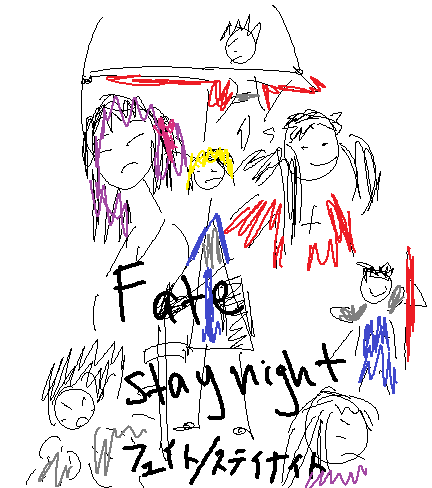
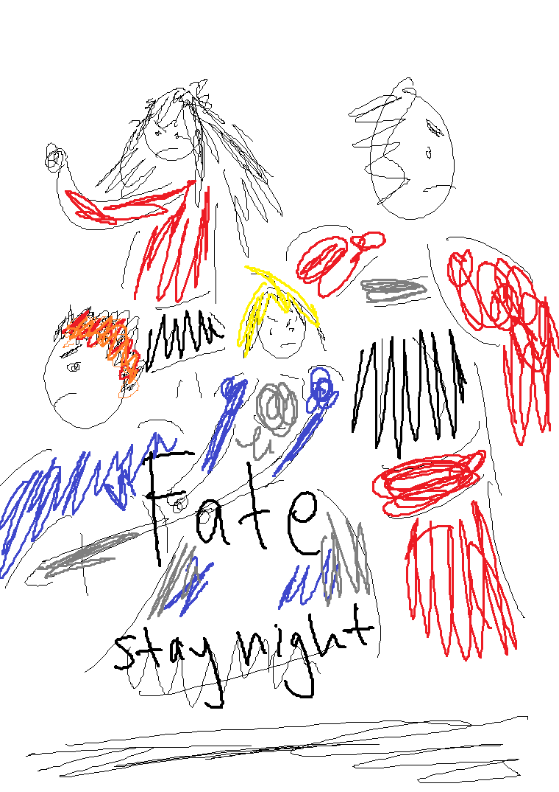

# Welcome.

I don't really have any good ideas on what to do with this site at the moment. The best one I have right now is a guide to the *Fate* franchise, so that is what I will do. Enjoy.

*Note: This will be covering mainly the entries that I know, a majority of which are the anime adaptations of the originals. This is not an extensive guide on everything from the series, not only because I don't know it all, but because it would also take far too long.*

*Secondary Note: For now this will just be focusing on adaptations of Fate/stay night since I don't have time to do the rest for now.*

## Fate/stay night

*Fate/stay night* is the first entry in the series, a Japanese visual novel released on January 30th, 2004 by Type-Moon. 

*Note: A **visual novel** is a type of interactive novel originating from Japan, played on PCs. It allows the players some choices within the story that can lead to different endings, although a majority of the experience is just text, whether it's narration, dialogue, inner monologues, or something else.*

The story follows Shirou Emiya, a Japanese high school student that falls into the world of magecraft through the *Holy Grail War*, a battle between 7 mages over the omnipotent wish-granting device, the Holy Grail. Each mage is given a familiar, called a Heroic Spirit, that is a famous figure from the past or even the future, summoned to the present to fight.

The most important thing you need to know when it comes to the basic structure of *Fate/stay night* is that the game can be split into 3 separate routes that the player can take, leading to different events and endings within the story.

These routes are:
- **Fate**
- **Unlimited Blade Works**
- **Heaven's Feel**

### Fate/stay night (DEEN)

An adaptation of the first route of the game, **Fate**. Produced by the animation studio DEEN and began airing in 2006. Contains a total of 24 episodes with each episode having a runtime of about 20 minutes.

### Fate/stay night: Unlimited Blade Works (DEEN)

An adaptation of the second route of the game, **Unlimited Blade Works**. Produced by studio DEEN and aired in 2010. This adaptation is an animated film, with a total runtime of 105 minutes. 

As the only anime adaptation of the first route, it would be good to watch it, but it is not at all necessary. A decent introduction for newcomers and has some surprisingly well animated fights. 

Has a major pacing problem, and for watchers not familiar with the story of the route already, it is very hard to understand. However, it is very well animated. Only reccomend watching after learning what is in the Unlimited Blade Works route.

### Fate/stay night: Unlimited Blade Works (ufotable)

Another adaptation of the second route, **Unlimited Blade Works**. Produced by animation studio ufotable and began airing in 2014. Contains a total of 26 episodes with each episode having a runtime of about 20 minutes. 

A very good entry point for newcomers. Being animated by ufotable, it looks amazing, and the fights are just as good-looking as well. If you can spare the time, it is a must-watch.

### Fate/stay night Heaven's Feel (ufotable)

An adaptation of the third route of the game, **Heaven's Feel**. An animated film trilogy produced by studio ufotable. 

- **Fate/stay night: Heaven's Feel I. presage flower** - 2017, 120 minutes
- **Fate/stay night: Heaven's Feel II. lost butterfly** - 2019, 117 minutes
- **Fate/stay night: Heaven's Feel III. spring song** - 2020, 122 minutes

Being a movie trilogy, the art and animation are spectacular, especially since it is being done by ufotable. The story and characters are great as well. Reccomended to watch Fate/stay night: Unlimited Blade Works (ufotable) before diving into this trilogy. An absolute, undisputed must-watch for any *Fate* fan.

### Notable Mention: Fate/Zero (ufotable)

An adaptation of the light novel series of the same name. Produced by ufotable and began airing in 2011. Contains a total of 25 episodes with each episode having a runtime of about 20 minutes.

This work serves as a prequel to Fate/stay night, following Shirou Emiya's adoptive father, Kiritsugu Emiya, in the previous Holy Grail War. Another great starting point for newcomers. If you didn't like Shirou in Fate/stay night, it would probably be better to start with this series, as it has a bit more depth than routes like Unlimited Blade Works in Fate/stay night. A must-watch for any fan and can easily be reccomended to non-*Fate* fans as well.

### Related: Fate/Grand Order

[Fate/Grand Order](https://fate-go.us/ "Fate/Grand Order US Official Site") is a smartphone game based on the *Fate* franchise released in 2015 (2017 for the US). The game uses characters from many of the different *Fate* works, even to some of the most obscure. Basically a giant melting pot for all original *Fate* works.

# people die when they are killed

this is the end. good job
